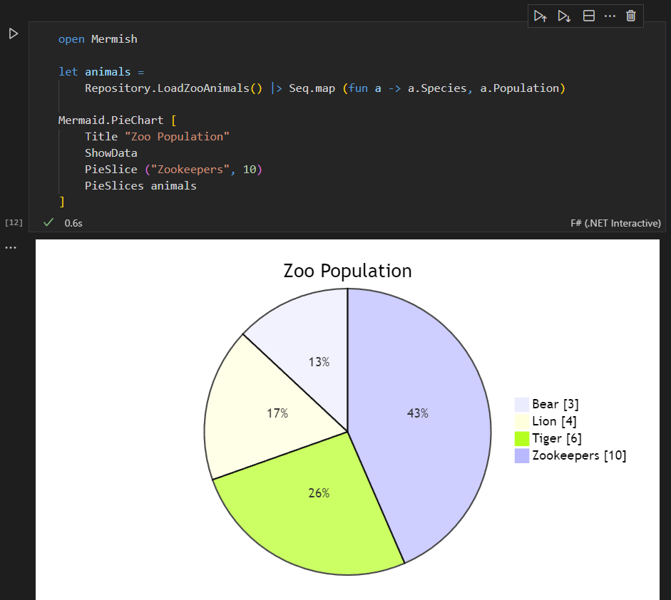
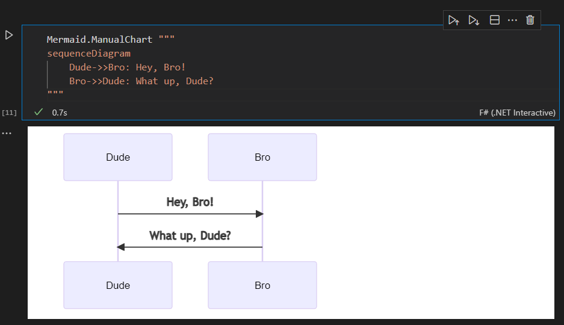

# Mermish

This library exists primarily to have a programmatic way to generate and display Mermaid charts in .Net Interactive:



It can also be used to generate Mermaid syntax for other reasons, or to create local .html files containing Mermaid charts.

```FSharp
#r "nuget: Mermish, 1.0.0-alpha.1"

open Mermish

type Animal = {
    Species : string
    Population : int
}

module Repository =
    let LoadZooAnimals() = [
        { Species = "Lion" ; Population = 4 }
        { Species = "Tiger" ; Population = 6 }
        { Species = "Bear" ; Population = 3 }
    ]

let animals = 
    Repository.LoadZooAnimals() |> Seq.map (fun a -> a.Species, a.Population)
    
let chart = Mermaid.PieChart [
    Title "Zoo Population"
    ShowData
    PieSlice ("Zookeepers", 10)
    PieSlices animals
]

printfn "%A" chart
// Outputs the following:
//
// pie showData
//     title Zoo Population
//     "Bear" : 3
//     "Lion" : 4
//     "Tiger" : 6
//     "Zookeepers" : 10

Mermaid.WriteToFile "output.html" chart
```

This is very much still a work in progress.  It's still buggy in .Net Interactive, and most of the chart types have not been implemented yet.  However, there's always the `ManualChart` to plug the holes:



-------------------------------------------------------------

> Dumbledore was crouching at the water's edge, deep in conversation with what seemed to be the chief merperson, a particularly wild and ferocious-looking female. He was making the same sort of screechy noises that the merpeople made when they were above water; clearly, Dumbledore could speak Mermish. 

_-- Harry Potter and the Goblet of Fire, J.K. Rowling_
